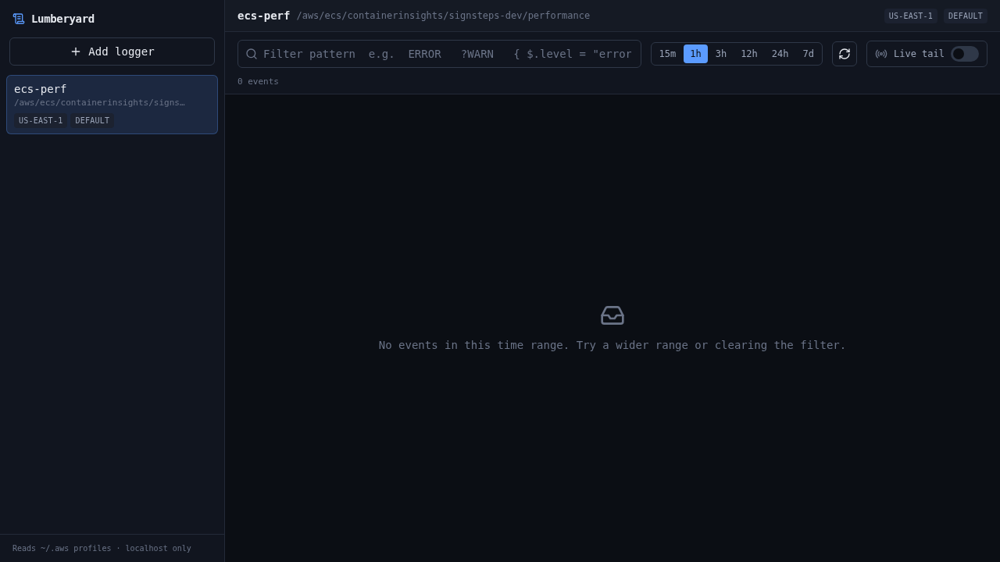

<h1 align="center">🪵 Lumberyard</h1>

<p align="center">
  A local, UI-friendly viewer for <b>AWS CloudWatch Logs</b>.<br/>
  Save your log groups once, then browse them with filters, time ranges, and live tail — no more wrestling the CLI.
</p>

<p align="center">
  
  = 20" />
  
  
</p>

<p align="center">
  
</p>

---

## Why

Viewing CloudWatch logs from the terminal (`saw`, `aws logs tail`, …) works, but you
can't easily save the log groups you check often, scope a time range, or eyeball
JSON without piping it somewhere. Lumberyard keeps your log groups one click away and
renders them in a clean, readable UI — with **live tail** when you want to watch
events stream in.

It reads your existing `~/.aws` profiles directly through the AWS SDK. Nothing is
uploaded anywhere; the whole thing runs on `localhost` and never stores or forwards
your credentials.

## Features

- 🗂 **Saved loggers** — name a log group + region + profile once; it persists across
  restarts (`~/.lumberyard/loggers.json`).
- 🔎 **Filtering** — CloudWatch filter patterns (`ERROR`, `?WARN`, `{ $.level = "error" }`)
  plus time-range presets (15m → 7d).
- 📡 **Live tail** — stream new events in real time with auto-scroll and "jump to latest".
- 🧩 **Readable events** — color-coded levels, expandable rows, pretty-printed JSON,
  copy-to-clipboard.
- ⚡️ **Log-group autocomplete** — discovers your log groups per profile/region as you type.
- 🔒 **Local & private** — binds to `127.0.0.1`; the UI only ever sees profile *names*,
  never secrets.

## Quick start

```bash
git clone https://github.com/<your-username>/lumberyard.git
cd lumberyard
npm install      # installs both workspaces
npm run dev      # backend on :4517, frontend on :5173
```

Open **http://localhost:5173** and click **Add logger**.

> **Prerequisites:** Node 20+ and AWS credentials in `~/.aws/config` /
> `~/.aws/credentials` (the same setup the AWS CLI uses).

## Usage

1. **Add a logger** — give it a name, pick a profile and region, then start typing the
   log group name. The field autocompletes from the groups it finds; if listing is
   denied by your IAM policy, just type the full name.
2. **Query** — select the logger, choose a time range, and optionally type a filter
   pattern. Press **Enter** to apply. *Load more* pages through older results.
3. **Live tail** — flip the **Live tail** toggle to stream new events. Scroll up to
   pause auto-scroll; hit *Jump to latest* to resume.
4. **Inspect** — click any row to expand it: full message, pretty JSON, log stream
   name, and a copy button.

### Filter pattern cheatsheet

| Pattern | Matches |
| --- | --- |
| `ERROR` | lines containing `ERROR` |
| `?ERROR ?WARN` | lines containing `ERROR` **or** `WARN` |
| `"timed out"` | the exact phrase |
| `{ $.level = "error" }` | JSON logs where `level` is `error` |
| `{ $.duration > 1000 }` | JSON logs where `duration` exceeds 1000 |

Full syntax: [CloudWatch Logs filter and pattern syntax](https://docs.aws.amazon.com/AmazonCloudWatch/latest/logs/FilterAndPatternSyntax.html).

## Required IAM permissions

Each logger needs read access to its log group:

```json
{
  "Effect": "Allow",
  "Action": [
    "logs:FilterLogEvents",
    "logs:DescribeLogGroups",
    "logs:StartLiveTail"
  ],
  "Resource": "*"
}
```

`DescribeLogGroups` powers autocomplete (optional — type names manually if denied)
and `StartLiveTail` powers live tail.

## How it works

Two pieces, both local:

- **`server/`** — Node + Express + TypeScript. Talks to CloudWatch via the AWS SDK
  using your `~/.aws` profiles, and persists your loggers. A browser can't read AWS
  credentials, which is why this thin backend exists.
- **`web/`** — React + Vite + TypeScript + Tailwind. The UI.

In dev, Vite proxies `/api/*` to the backend. In production the backend serves the
built frontend, so it's a single process.

```
server/src/
  index.ts            express app + prod static serving
  aws.ts              CloudWatch Logs client factory (per profile/region)
  store.ts            atomic JSON persistence (~/.lumberyard/loggers.json)
  routes/
    loggers.ts        CRUD for saved loggers
    profiles.ts       profile names from ~/.aws (names only)
    discovery.ts      DescribeLogGroups for autocomplete
    logs.ts           FilterLogEvents (historical, paginated)
    tail.ts           StartLiveTail over SSE
web/src/
  App.tsx             layout + query/tail orchestration
  components/         sidebar, logger form, filter bar, log viewer/rows
  hooks/              useLoggers, useProfiles, useLogs, useLiveTail
  lib/                api client, types, log formatting
```

## Configuration

| Variable | Default | Description |
| --- | --- | --- |
| `PORT` | `4517` | Backend port. If you change it, update the proxy target in `web/vite.config.ts`. |

Saved loggers live in `~/.lumberyard/loggers.json` — plain JSON you can edit or back up.

### Production build

```bash
npm run build    # builds web/, then server/
npm start        # serves the built UI on http://localhost:4517
```

## Contributing

Issues and PRs are welcome! To work on it:

```bash
npm install
npm run dev
```

Both workspaces are TypeScript with `strict` mode on. Please run the type checks
before opening a PR:

```bash
npm run build    # type-checks web/ and server/
```

See [CLAUDE.md](CLAUDE.md) for an architecture overview and project conventions
(useful for humans and AI coding assistants alike).

## License

[MIT](LICENSE) © 2026
